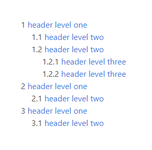

# Table of contents plugin for Craft CMS 3.x

This plugin generates a table of contents from HTML headers in text. Anchor links in table direct to corresponding headers in text.

Table of contents can be nested - nesting level will be based on header level.

Here's screenshot of  example table of contents generated by plugin:



## Requirements

This plugin requires Craft CMS 3.0.0-beta.23 or later.

It also requires [Anchors plugin](https://plugins.craftcms.com/anchors), since it makes use of its internal functions.

## Installation

You can install this plugin from the Plugin Store or with Composer. 

To install plugin with composer, run following command:

```bash
composer require craftsnippets/table-of-contents
```
Then in the control panel go to settings, plugins - and click "install" next to "table of contents".

## Usage

To create the table of contents, you need to pass HTML containing headers to `craft.toc.getLinks` function and output returned data using `` Twig tag. 

Don't forget to also put your HTML through `anhors` filter provided by Anchors plugin - it will add `id` attribute to headers, so anchor links inside the table of contents have something to direct to.

Remember to use `anchors` filter **after** passing HTML to `getLinks` function. Otherwise, links in table of contents would contain escaped HTML content of links that were added to headers by Anchors plugin.

```

some text with headers...




 <ul>
    
        <li>
            <a href="{{ link.hash }}">{{ link.text }}</a>
            
                <ul>
                    
                </ul>
            
        </li>
    
</ul>

{{text|anchors}}
```
Don't forget to give each of your links bit of left margin to show their hierarchy.

```
li{
  margin-left: 1rem;
}
```

## Nested numeric list

To display numeric count before links within the table of contents, you can use bit of CSS. This will work also for nested lists.

```
ul {
  counter-reset: section;               
  list-style-type: none;
}
li::before {
  counter-increment: section;            
  content: counters(section, ".") " "; 
}
```

## Alternative header tags

By default, Table of contents plugin searches for `h1`, `h2` and `h3` tags. Just like in Anchors plugin, this can be overwritten by passing the second argument to `getLinks` function.

```

```

Don't forget to do the same when using `anchors` filter.

## Smooth scrolling

You can achieve smooth scrolling effect with single CSS property.

```
html{
   scroll-behavior: smooth;
}
```
Unfortunetly it does not wok on Safari or IE - see more on [caniuse](https://caniuse.com/#search=scroll-behavior).

Same effect that works in all modern browsers can be achieved with this jQuery code:

```
  $('.table-of-contents a').on('click', function(event) {
    var hash = '#' + $(this).attr('href').split('#')[1]
    var element = $(hash)
    if (element.length) {
      event.preventDefault();
      history.pushState(hash, undefined, hash)
      $('html, body').animate({scrollTop: element.offset().top}, 500)
    }
  });   

  window.addEventListener('popstate', function(e) {
    if(e.state && e.state.startsWith('#') && $(e.state).length){
      $('html, body').animate({scrollTop: $(e.state).offset().top}, 500)
    }
  });

  $('html, body').on("scroll mousedown wheel DOMMouseScroll mousewheel keyup touchmove", function(){
    $('html, body').stop();
  });
```
If a user start to scroll (using mouse scroll wheel) during an animation, scrolling will be canceled to avoid "fighting" with it.

Despite animation replacing `click` event, hash will still be appended to URL and browser back or forward buttons will work - thanks to use of JavaScript history API.

----

Icon made by [Dave Gandy](https://www.flaticon.com/authors/dave-gandy) from [www.flaticon.com](https://www.flaticon.com/).

----

Brought to you by [Piotr Pogorzelski](http://craftsnippets.com)
